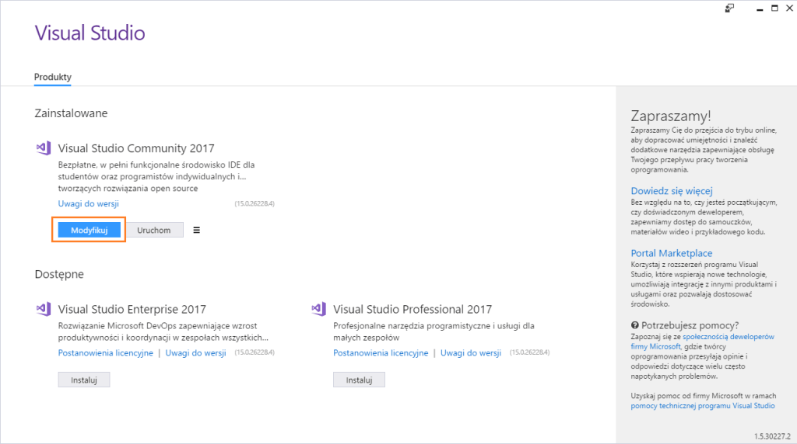
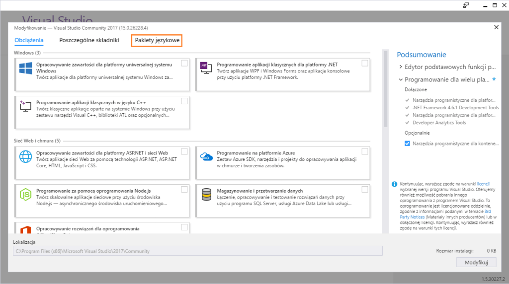
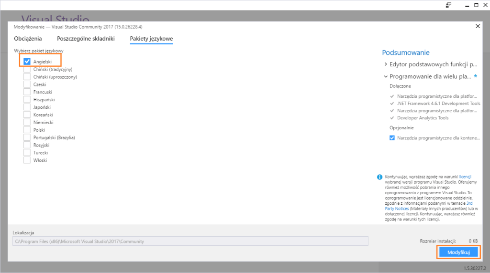

Engineers love the new tools – that’s a fact. New IDE release is kind of Christmast Eve for all developers of a platform. Releasing Visual Studio 2017 is not an exception!

It has tens of cool features which are widely described all over the Internet. The problem is, that those tutorials and reviews are all in English and my Visual Studio installed in… a default language of my system – Polish.

I can’t get so deep into a idea of translating IDE, so I will just leave it without comment, so let’s go to the instruction.

1. First, go to the VisualStudio Installer – a little app which handles this bold venture called “Instalation of Visual Studio”. You can find it here:
   ```
   C:\Program Files (x86)\Microsoft Visual Studio\Installer\vs_installer.exe
   ```
2. On the top you have an installed version of VS. Click translation of “Modify” in your current language. In my case “Modyfikuj”.
    
3. You will see a list of components installed in your Visual Studio version. Choose another tab, an equivalent of “Language Packages”. In my case “Pakiety językowe”.
    
4. Simply Select “English” (“Angielski”), and to be honest I recommend you to deselect others.
    
5. Click “Modify” on the right bottom and wait for process to be finished.
6. Run your Visual Studio 2017 again – you have English version now.

I hope it helped! Cheers!

UPDATE: Recently VS 2019 has been released. Changing the language in this version is pretty much the same as in VS 2017.