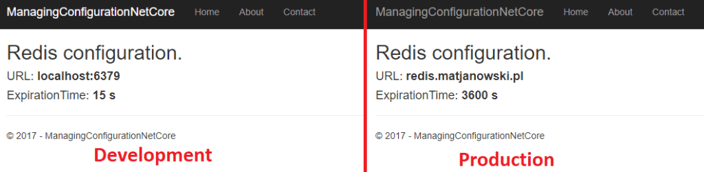
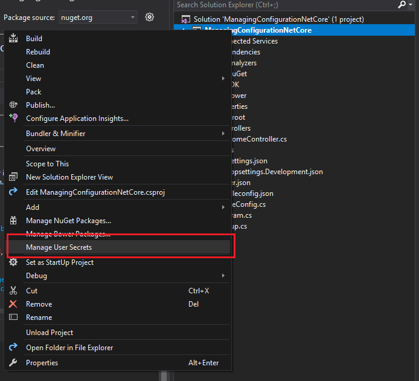
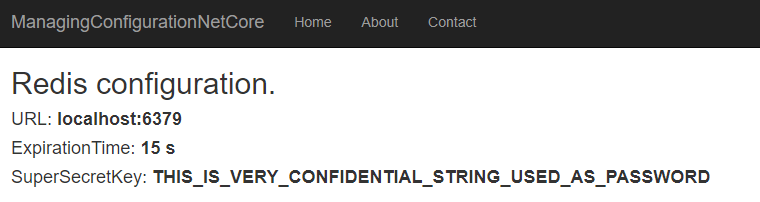
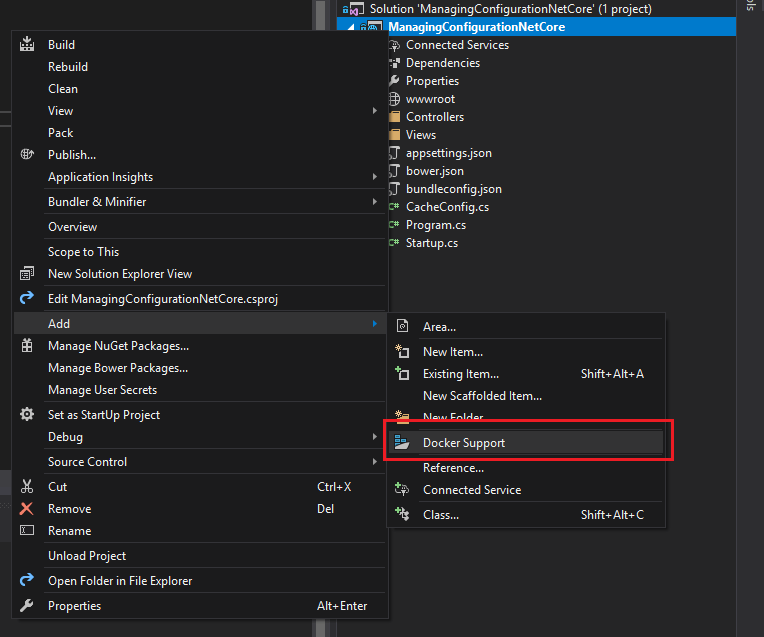

.NET Core comes with tens of good patterns and helpers which are supposed to help developers to create high quality code which is easy to maintain and fast to develop. Numerous tools help us to be more productive but also encourage us to be responsible for our code and developer assets.

I’m going to show you how do I solve the problem of managing configuration in .NET Core, including multiple environments, secrets and Docker.

## App Settings

First of all: where do we use configuration? Of course there is no simple answer for that and it always depends, but my strategy for this is following. Each time when you use some constant (regardless of having them in the constant field or just used value) ask yourself: “Might this value ever change?”. If the answer is “yes” or “maybe” you should put it into a configuration value.

Example:
* `String.Empty` – constant
* Number of minutes to expire cache – configuration value

In old .NET Framework we had a class called `ConfigurationManager` which had two main drawbacks: it used XML (the part of App.config file) and it was a static class, so you couldn’t easily mock it or inject. What we have now in .NET Core are Options and an interface `IConfigurationRoot` which is a root of all configuration nodes. It means that now we don’t have a flat configuration file with tens or hundreds of floating configuration keys, but a structured and grouped application settings.

To start working with this, you need to use `ConfigurationBuilder`. If you use ASP.NET Core it’s worth to build it in the `Statup` constructor, where you have access to `IHostingEnvironment` and you can choose used configuration file is going to be used.

The construction can look like this:
```csharp
public Startup(IHostingEnvironment env)
{
    var builder = new ConfigurationBuilder()
        .SetBasePath(env.ContentRootPath)
        .AddJsonFile("appsettings.json", reloadOnChange: true)
        .AddJsonFile($"appsettings.{env.EnvironmentName}.json", optional: true)
        .AddEnvironmentVariables();
    Configuration = builder.Build();
}

public IConfigurationRoot Configuration { get; }
```

* `SetBasePath` tells where should all files are placed. In the typical scenario it’s the current root path.
* `AddJsonFile` adds a particular file to our configuration. It’s important to use the one that corresponds to the current environment. We should treat
* `appsettings.json` as a common configuration file, while the one with environment name suffix is a environment specific one. Basically, one uses two basic environments: Development and Production (files: `appsettings.Development.json`, `appsettings.Production.json`), but for real business projects you should include Staging and Testing environments with setting values defined according to your needs. There are also two optional parameters: when you set  `optional` to `true`, it means that you will not get any exception when the file does not exist and `reloadOnChange` will just update the configuration tree in memory every time when you edit a file.
* `AddEnvironmentVariables()` adds a support for locally configured environment variables, so when you set up a variable you can use it in the app. `auth:token` crates a `token` value in `auth` section.

There is a bunch of providers available on NuGet which supports other files or sources. There is no problem to use XML or ini files. Just search for `Microsoft.Extensions.Configuration` and find something for you. There is something else worth to mention which is `Microsoft.Extensions.Configuration.AzureKeyVault`. It provides a service for storing secret data in secure storage on Azure – I’ll go deeper into this concept on another post.

Let’s add just two simple files with some service configuration files:
`appsettings.json`:
```json 
{
  "RedisCache": {
    "Url": "redis.matjanowski.pl",
    "ExpireTimeInSeconds": 3600
  }
}
```

and `appsettings.Development.json`:
```json
{
    "RedisCache": {
        "Url": "localhost:6379",
        "ExpireTimeInSeconds": 15
    }
}
```

As you see, `RedisCache` node is well-defined and we can type a simple class which describes it:

```csharp
public class CacheConfig
{
    public string Url { get; set; }
    public int ExpireTimeInSeconds { get; set; }
}
```

So far so good! We are ready to use our configuration in the app. The ASP.NET Core gives an ability to register it in the container so we can inject it into other classes. When we use default ASP.NET Core Dependency Container we should configure services in `ConfigureServices` method in `Startup` class:
```csharp
public void ConfigureServices(IServiceCollection services)
{
    services.Configure<CacheConfig>(Configuration.GetSection("RedisCache"));
    services.AddMvc();
}
```

Then you can inject the confiruration into your classes wrapped in a `IOptions<T>` class where `T` is the config class defined a while ago:

```csharp
public class HomeController : Controller
{
    private readonly CacheConfig _config;

    public HomeController(IOptions<CacheConfig> config)
    {
        _config = config.Value;
    }

    public IActionResult About()
    {
        ViewData["Time"] = _config.ExpireTimeInSeconds;
        ViewData["Url"] = _config.Url;

        return View();
    }
}
```
Depending on the running environment I get different results on my view:

## Secrets
There is a temptation to use app settings to all kinds of variable config values, but there are some which should not be saved in the `appsettings.json`.

DO NOT SAVE IN `appsettings.json` FOLLOWING SETTINGS:

* connection strings
* passwords
* password hashes
* API keys
* tokens
* “Peppers”
* cryptographic keys
* … and other values which are confidential

Remember that those files are checked in your source code control system and you probably don’t want to share your production passwords with all repository users. What’s more, it might happen that some day your repository will be compromised or you simply go open source. I can bet, that there are tens of confidential data on GitHub or BitBucket public repositories. You don’t want to make this mistake.

.NET Core comes to you with a solution. They developed sort of provider which apart of looking into `appsettings.json` uses values from some `secret.json` file which is saved on each developer’s machine locally in the special folder assigned to the project (the folder name is a GUID specific for a project).

So to use them we will use VisualStudio 2017. We will need to install another NuGet package: `Microsoft.Extensions.Configuration.UserSecrets`. Next, let’s use IDE to generate secrets.json in a proper directory. Right-click on the project and choosing “Manage User Secrets” will do the thing.


A JSON file will open, but nothing will be added into your project. It’s been created in one of the following folders (depending on your OS):

* Windows: `%APPDATA%\microsoft\UserSecrets\<userSecretsId>\secrets.json`
* Linux: `~/.microsoft/usersecrets/<userSecretsId>/secrets.json`
* Mac: `~/.microsoft/usersecrets/<userSecretsId>/secrets.json`
 The `<userSecretsId>` is basically a GUID which can be checked in the `.csproj` file.

Let’s setup some configuration here:
```json
{
    "RedisCache": {
        "Key": "THIS_IS_VERY_CONFIDENTIAL_STRING_USED_AS_PASSWORD"
    }
}
```

The last thing to use it is adding secrets support into our configuration. *We will do it only in Development environment, though, since it’s not recommended to use user’s secrets on the production*.
```csharp
var builder = new ConfigurationBuilder()
    .SetBasePath(env.ContentRootPath)
    .AddJsonFile("appsettings.json", optional: false, reloadOnChange: true)
    .AddJsonFile($"appsettings.{env.EnvironmentName}.json", optional: true)
    .AddEnvironmentVariables();

if (env.IsDevelopment())
{
    builder.AddUserSecrets<Startup>();
}
```

The class passed in the generic parameter is any one defined in the assembly which is a result of building project with `UserSecretsId` defined in it’s `csproj` file.

Now you can use it as a regular configuration, with this difference that it’s only visible on your machine. Each developer needs to create own `secrets.json`.

```csharp
public IActionResult About()
{
    ViewData["Time"] = _config.ExpireTimeInSeconds;
    ViewData["Url"] = _config.Url;
    ViewData["Key"] = _config.Key; // displaying it, is a terrible example :)

    return View();
}
```

Additionally some tweaks in the view and…. the result is:


You can distribute secret values to developers in some safe way, but remember that those values are used only for development purposes.
## Secrets in Docker
Once Microsoft went OpenSource and the hell got frozen, they also started to be open for many external tools like Docker. Microsoft started using Docker for internal projects but also added very good support for it in Visual Studio 2017. But if we run our app in a container, we are loosing an access to the `secrets.json` stored somewhere on the host machine. Let’s tackle this problem. I’m starting with adding Docker support via VS2017. Again, right-click → Add → Docker support. It’ll ask for a version of container and I’m choosing Linux. Next steps will depend of this decision.


Magic is happening now and we have new “project” available. If we have Docker deamon started, we can run the program. The first build might take a while to download all needed images. When the app starts you, your secret configuration value will be empty. Why it’s so? It’s because the app started in sandbox environment on Linux, so it cannot reach the secret value from your `usersecrets` directory.

What we need to do is mounting a volume with the `secret.json`. Let’s open `docker-compose.override.yml` and change from this:
```yaml
version: '3'

services:
  managingconfigurationnetcore:
    environment:
      - ASPNETCORE_ENVIRONMENT=Development
    ports:
      - "80"
```
to this:

```yaml
version: '3'

services:
  managingconfigurationnetcore:
    environment:
      - ASPNETCORE_ENVIRONMENT=Development
      - USER_SECRETS_ID=836b9b8b-fd89-4aff-9286-809bda60998f
    ports:
      - "80"
    volumes:
      - $APPDATA/Microsoft/UserSecrets/$USER_SECRETS_ID:/root/.microsoft/usersecrets/$USER_SECRETS_ID
      - $HOME/.microsoft/usersecrets/$USER_SECRETS_ID:/root/.microsoft/usersecrets/$USER_SECRETS_ID
```

What I’ve added are essentially 4 lines. I’ve defined an environment variable with `UserSecretsId` created in the `.csproj` (it’s inside the `UserSecretsId` tag) and I’ve defined `volumes:` section with two rules. First of them covers a Windows hosting machine and the second one covers Linux and Mac. I didn’t test it on Linux or Mac but should work as well as on Windows OS. Of course having both lines here is redundant, but we should not depend on a single developer machine’s OS in our source code. The alternative to that is just defining another `docker-compose` file and override the existing one depending on the development machine. Anyway, the principle is the same.

_Note: If you’ve chosen Windows container when adding Docker support, you must change destination path to Windows pattern in volumes section._

There are some dedicated NuGet packages which support secrets inside [Docker swarm](https://docs.docker.com/engine/swarm/secrets/), but I’m not a fan of those. Your source code ought to be tools-agnostic so it shouldn’t know what development tools you’re using, whether it’s Docker, VMs or whatever.

## Real-life suggestions
So if secrets are located only on my machine how the production app knows what are they? Of course we should place it on the production (or any remote environment) in some safety way during the deployment process. Very good solution is to use remote secrets vault (like Azure Key Vault or Vault from HashiCorp).