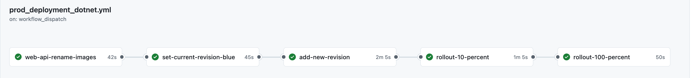

Hey there! 👋 Let's talk about something that's been making my deployments much less stressful lately - blue/green deployments in Azure Container Apps. You know that feeling when you're about to deploy to production and your heart starts racing? Yeah, we've all been there. But what if I told you there's a way to make it feel more like a smooth sail rather than walking on a tightrope?

## Let's See It in Action First!

Before I dive into the nitty-gritty details, check out this visualization of our production deployment pipeline in GitHub Actions:



Pretty neat, right? This isn't just some fancy diagram - it's our actual production pipeline in action. It shows how we carefully orchestrate our deployment through several stages:

1. First, we prepare our images (web-api-rename-images)
2. Then, we mark our current production version as "blue" (set-current-revision-blue)
3. Next, we deploy our new version as "green" (add-new-revision)
4. We start with a small rollout (rollout-10-percent)
5. Finally, we go all in! (rollout-100-percent)

Each step has its purpose, and trust me, this measured approach has saved my bacon more than once!

## What's This Blue/Green Thing Anyway?

Imagine you're a street performer (stick with me here!). Instead of just switching acts in front of your audience, you set up a second stage nearby. You prepare your new act on the second stage while the current show goes on. Once everything's ready, you smoothly guide your audience to the new stage. That's basically what blue/green deployment is!

In more technical terms, you maintain two identical production environments. While one serves traffic (let's say the blue one), the other sits quietly on the side (that's our green one). When it's time to deploy, we get the new version ready in the quiet environment, and then - here's the cool part - we gradually shift traffic over to it.

## How We Make It Happen

Let me show you how we implement this in real life. I'll break it down into the juicy parts that actually matter.

### Setting Up Our New Version

First things first - we need to get our new version ready to rock:

```yaml
- name: Build and Push Docker image
  working-directory: ${{ env.API_WORKDIR }}
  run: |
    docker build . -t ${{ vars.ACR_LOGIN_SERVER }}/${{ env.APP_NAME }}-api:${PROD_TAG}
    docker push ${{ vars.ACR_LOGIN_SERVER }}/${{ env.APP_NAME }}-api:${PROD_TAG}
```

This is just us packaging up our application into a nice, neat container and storing it in Azure Container Registry. Think of it as preparing your costume before the show!

### The Clever Part: Canary Deployments

Now, here's where it gets interesting. Instead of just throwing our new version out there and hoping for the best, we use something called a canary deployment. Why canary? Well, back in the day, miners used to take canaries into coal mines - if the canary stopped singing, they knew there was trouble with the air. We're doing something similar with our code!

We start by sending just 10% of our users to the new version:

```yaml
az containerapp ingress traffic set \
  --name ${{ env.CONTAINER_APP_NAME }} \
  --label-weight blue=90 green=10
```

This means if something goes wrong, we've only affected a small portion of our users. Pretty considerate of us, right? During this time, we're watching everything like a hawk:
- Are there any errors popping up?
- Is the application running as fast as it should?
- Are users still able to do what they need to do?
- Is our database behaving itself?

### Safety First: Deployment Gates

Here's a pro tip I learned the hard way: never let your pipeline run wild without some safety checks! We use deployment gates, which are like responsible friends who won't let you send that late-night message to your ex without reading it twice.

One way to add these safety checks is through GitHub's environment protection rules. These allow you to require approvals before deployments can proceed:

```yaml
jobs:
  rollout-100-percent:
    environment: 
      name: production
      url: https://your-app-url.com
```

Now, a quick heads-up about this feature: while it's available for public repositories on all GitHub plans, for private repositories you'll need GitHub Pro, GitHub Team, or GitHub Enterprise. It's one of those "premium" features that, while nice to have, isn't essential for implementing blue/green deployments.

But don't worry if you're not on those plans! There are other ways to implement safety checks. My personal favorite is using automated metric-based gates:

```yaml
- name: Check deployment metrics
  run: |
    error_rate=$(az monitor metrics list \
      --resource ${{ env.CONTAINER_APP_NAME }} \
      --metric "http5xx")
    
    if [ "$error_rate" -gt "0.1" ]; then
      echo "Whoa there! Error rate is too high!"
      exit 1
    fi
```

## The Grand Finale

Once everything looks good, we go all in:

```yaml
az containerapp ingress traffic set \
  --name ${{ env.CONTAINER_APP_NAME }} \
  --label-weight blue=0 green=100
```

And just like that, we've successfully deployed our new version! But here's the best part - if anything goes wrong, we can quickly switch back to our blue environment. It's like having a time machine for your deployments!

## Wrapping Up

Blue/green deployments in Azure Container Apps have been a game-changer for our team. Sure, it might seem like a bit more work upfront, but trust me, it's worth it. The peace of mind you get from knowing you can quickly rollback if needed is priceless.

Remember, the goal here isn't just to deploy faster - it's to deploy more safely and confidently. And isn't that what we all want? Sweet dreams of zero-downtime deployments, my friends! 

Got questions? Found a cool way to improve this setup? I'd love to hear from you! Drop a comment below or hit me up on Twitter. After all, we're all in this together, trying to make our deployments less scary and more reliable! 🚀